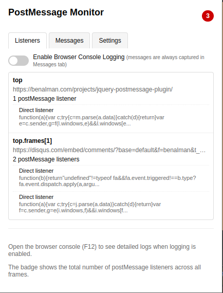
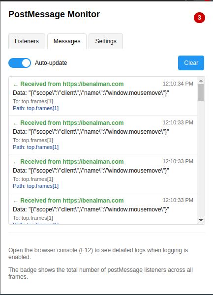
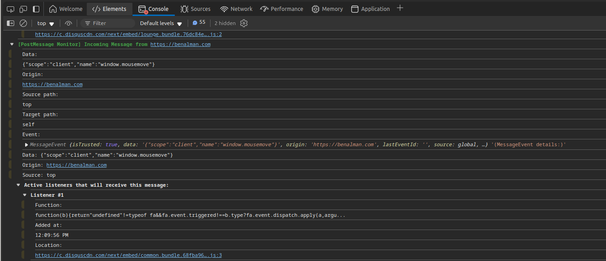

# PostMessage Monitor

A Chrome extension for monitoring and debugging postMessage communication across frames and windows. It´s a contiunation of the great [postMessage-tracker](https://github.com/fransr/postMessage-tracker) extension by Frans Rosén (some logic for unwrapping/ideas are borrowed and based on his research! Check him out!).

## Overview

PostMessage Monitor helps developers and security researchers inspect all postMessage events on a page, track message listeners, and detect communication patterns between frames. It provides real-time visibility into cross-origin messaging that is otherwise difficult to debug.
Showing listeners             |  Showing messages
:-------------------------:|:-------------------------:
 | 
Console logging:

## Key Features

- **Real-time Monitoring**: Captures all postMessage communications across frames and windows
- **Listener Detection**: Shows all registered postMessage event listeners across frames
- **Library Unwrapping**: Automatically detects and unwraps listeners from common libraries (Sentry, New Relic, etc.)
- **Message Replay**: Provides paths to help you replay messages for testing
- **State Persistence**: Remembers settings across page reloads
- **Frame Hierarchy**: Visualizes the relationship between frames and their message paths
- **Location Detection**: Shows original source locations for event listeners

## Installation

### From Source (Developer Mode)

1. Clone this repository or download the source code
2. Open Chrome and navigate to `chrome://extensions/`
3. Enable "Developer mode" in the top right corner
4. Click "Load unpacked" and select the extension folder
5. The extension should now be installed and active

## Usage

### Basic Monitoring

1. Open the webpage you want to monitor
2. Click on the PostMessage Monitor extension icon to open the popup
3. View active postMessage listeners in the "Listeners" tab
4. See all captured messages in the "Messages" tab
5. Toggle "Enable Browser Console Logging" to see detailed logs in the browser console (F12)

### Advanced Features

- **Unwrapper Settings**: The extension automatically unwraps listeners from common libraries. Configure these in the Settings tab.
- **Test postMessage**: Send test messages to verify listener functionality
- **Frame Navigation**: See which frames have registered listeners and how they communicate
- **Message Paths**: Use the provided paths to replay messages in the console for testing

## For Security Researchers

PostMessage Monitor is particularly useful for:

- Discovering undocumented messaging channels between frames
- Identifying potential postMessage security vulnerabilities
- Testing for proper origin validation in message handlers
- Mapping out cross-origin communication patterns

## Technical Details

The extension consists of several components:

- **Content Script**: Injected into each frame to bridge communication
- **Page Script**: Injected into the page context to monitor raw postMessage traffic
- **Background Script**: Maintains state and coordinates between frames
- **Popup UI**: Provides visualization and control interface

### Supported Wrapper Libraries

The extension can automatically unwrap postMessage listeners from:

- Raven/Sentry
- New Relic
- Rollbar
- Bugsnag
- jQuery

## Privacy Note

This extension only monitors postMessage communication within your browser. No data is sent to external servers or shared with third parties.